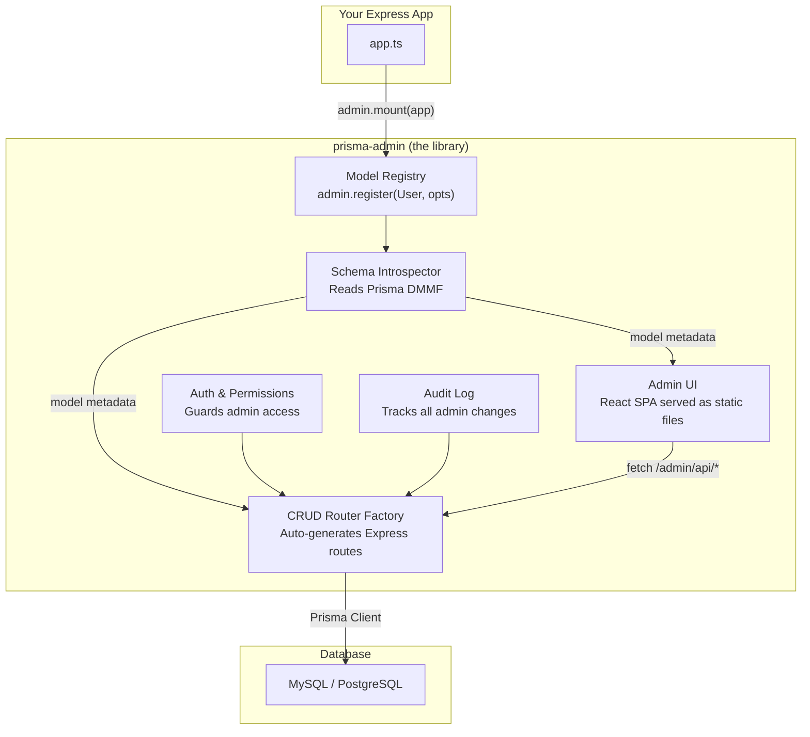
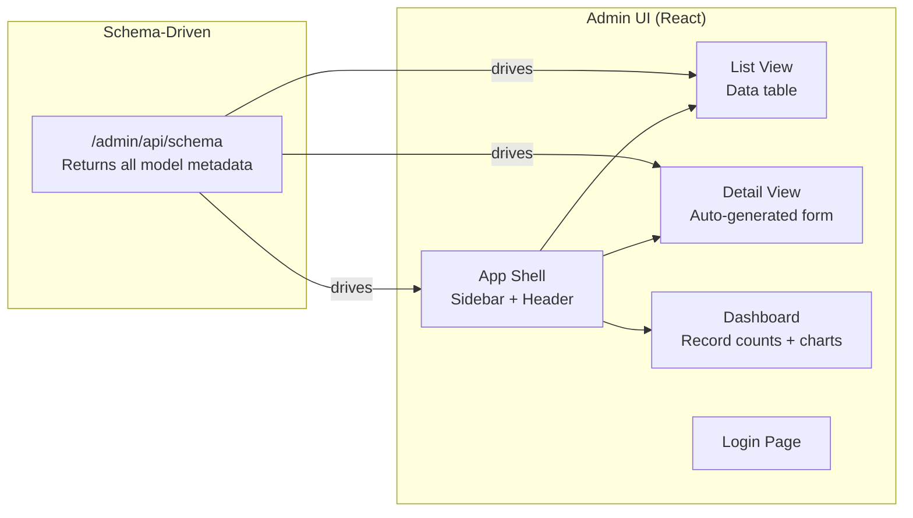

# 🏗️ Building a Django-Admin-like Tool for Express + Prisma

## The Advantage: Prisma's DMMF

The reason this is *feasible* for Prisma specifically is **DMMF** (Data Model Meta Format). When you run `prisma generate`, Prisma creates a full JSON representation of your schema that's accessible at runtime:

```typescript
import { Prisma } from '@prisma/client';

const dmmf = Prisma.dmmf;
// dmmf.datamodel.models → every model, field, relation, enum
```

This is your equivalent of Django's model introspection. **Everything below builds on this.**

> ⚠️ **DMMF Stability Warning:** `Prisma.dmmf` is not formally part of Prisma's public API surface. It is accessible and widely used, but Prisma has broken its shape between major versions before. Treat it as a dependency you actively maintain: pin your supported Prisma peer dependency range (`"prisma": ">=5.0.0 <7.0.0"`), run your test suite against each new Prisma minor, and document the version matrix clearly in your README. This is non-negotiable for a published library.

---

## Architecture Overview



---

## Layer 1: Schema Introspector

### What It Does

Reads Prisma's DMMF and transforms it into a normalized metadata format the rest of the system understands.

### Prisma DMMF Structure

When you access `Prisma.dmmf.datamodel.models`, you get structures like this:

```typescript
// What Prisma gives you for each model:
{
  name: "User",
  fields: [
    {
      name: "id",
      kind: "scalar",        // scalar | object | enum | unsupported
      type: "String",        // String, Int, Float, Boolean, DateTime, Json, Bytes
      isId: true,
      isUnique: true,
      isRequired: true,
      isList: false,
      hasDefaultValue: true,
      default: { name: "uuid", args: [] },
      isGenerated: false,
      isUpdatedAt: false,
    },
    {
      name: "email",
      kind: "scalar",
      type: "String",
      isUnique: true,
      isRequired: true,
      // ...
    },
    {
      name: "role",
      kind: "enum",
      type: "UserRole",       // references Prisma enum
      isRequired: true,
      // ...
    },
    {
      name: "institution",
      kind: "object",          // THIS IS A RELATION
      type: "Institution",
      relationName: "UserToInstitution",
      relationFromFields: ["institutionId"],  // FK field
      relationToFields: ["id"],               // target PK
      isList: false,          // false = belongsTo, true = hasMany
      // ...
    },
    {
      name: "posts",
      kind: "object",
      type: "Post",
      isList: true,           // hasMany
      // ...
    }
  ]
}
```

### What You'd Build

```typescript
// introspector.ts

interface AdminFieldMeta {
  name: string;
  type: "string" | "number" | "boolean" | "datetime" | "json" | "enum" | "relation";
  prismaType: string;              // raw Prisma type
  isId: boolean;
  isRequired: boolean;
  isUnique: boolean;
  isReadOnly: boolean;             // auto-generated fields (id, createdAt)
  isFilterable: boolean;           // can appear in list filters
  isSearchable: boolean;           // included in text search
  defaultValue: any;
  enumValues?: string[];           // for enum fields
  relation?: {
    model: string;                 // related model name
    type: "belongsTo" | "hasMany" | "manyToMany";
    foreignKey: string;
    displayField: string;          // what to show in dropdowns (e.g., "name")
  };
}

interface AdminModelMeta {
  name: string;                    // "User"
  pluralName: string;              // "users"
  prismaModelName: string;         // used for prisma[modelName].findMany()
  fields: AdminFieldMeta[];
  idField: string;                 // primary key field name
  displayField: string;            // human-readable identifier (e.g., "email")
  searchableFields: string[];      // fields included in search
  filterableFields: string[];      // fields shown as filters
  timestamps: {
    createdAt?: string;
    updatedAt?: string;
  };
}

function introspect(): Map<string, AdminModelMeta> {
  const models = Prisma.dmmf.datamodel.models;
  const enums = Prisma.dmmf.datamodel.enums;

  return models.map(model => {
    // Transform each DMMF model into AdminModelMeta
    // - Map Prisma types to UI types
    // - Detect relations and their cardinality
    // - Identify searchable fields (String types)
    // - Identify filterable fields (enums, booleans, dates, FKs)
    // - Mark auto-generated fields as read-only
  });
}
```

### Key Decisions

- **Which fields are searchable?** Default: all `String` fields. Override via config.
- **Which fields are filterable?** Default: enums, booleans, DateTime, foreign keys.
- **What's the display field?** Default: first unique string field (e.g., `email`, `name`). Override via config.
- **Which fields to show in list view?** Default: first 6 non-relation scalar fields. Override via config.

---

## Layer 2: Model Registry (The Developer API)

### What It Does__

This is how developers register models and customize their admin behavior. It's the equivalent of Django's `admin.site.register()`.

### API Design

```typescript
// admin.ts — the public API

import { PrismaClient } from '@prisma/client';
import { Express } from 'express';

const prisma = new PrismaClient();

const admin = createAdmin({
  prisma,
  basePath: "/admin",          // mount path
  auth: {
    // How to authenticate admin users
    strategy: "session",       // or "jwt"
    loginCheck: async (email, password) => { /* verify credentials */ },
    roleCheck: async (userId) => { /* return admin permissions */ },
  }
});

// Register with defaults (auto-generates everything from schema)
admin.register("User");

// Register with customization
admin.register("User", {
  // List view config
  listDisplay: ["email", "fullName", "role", "isActive", "createdAt"],
  listFilter: ["role", "isActive", "institutionId"],
  searchFields: ["email", "fullName"],
  defaultSort: { field: "createdAt", direction: "desc" },
  perPage: 25,

  // Detail/Form view config
  fieldsets: [
    {
      title: "Basic Info",
      fields: ["email", "fullName", "role"],
    },
    {
      title: "Institution",
      fields: ["institutionId"],
      collapsed: true,     // collapsed by default
    }
  ],

  // Inline related models (like Django's TabularInline)
  inlines: [
    {
      model: "StudentProfile",
      foreignKey: "userId",
      fields: ["identificationNumber", "level"],
    }
  ],

  // Field overrides
  fields: {
    password: { exclude: true },   // never show
    email: { readOnly: true },      // can't edit after creation
    role: { widget: "radio" },      // UI widget type
    bio: { widget: "richtext" },
  },

  // Custom actions (like Django admin actions)
  actions: [
    {
      name: "deactivate_selected",
      label: "Deactivate Selected Users",
      handler: async (ids, prisma) => {
        await prisma.user.updateMany({
          where: { id: { in: ids } },
          data: { isActive: false },
        });
        return { message: `Deactivated ${ids.length} users` };
      },
    },
    {
      name: "export_csv",
      label: "Export as CSV",
      handler: async (ids, prisma) => { /* generate CSV */ },
    }
  ],

  // Hooks
  beforeCreate: async (data) => { /* hash password, validate, etc. */ },
  afterCreate: async (record) => { /* send email, emit event, etc. */ },
  beforeUpdate: async (id, data) => { /* ... */ },
  beforeDelete: async (id) => { /* prevent deletion of super admin */ },

  // Permissions per action
  permissions: {
    list: ["SUPER_ADMIN", "ADMIN"],
    view: ["SUPER_ADMIN", "ADMIN"],
    create: ["SUPER_ADMIN"],
    update: ["SUPER_ADMIN", "ADMIN"],
    delete: ["SUPER_ADMIN"],
  },

  // Scoping - filter records by logged-in user's context
  // (critical for multi-tenant apps like yours)
  scope: async (adminUser) => {
    if (adminUser.role === "SUPER_ADMIN") return {};  // see everything
    return { institutionId: adminUser.institutionId }; // only their institution
  },
});

// Mount on Express
admin.mount(app);
// This creates:
//   GET  /admin              → Admin UI (React SPA)
//   GET  /admin/api/:model   → List records
//   GET  /admin/api/:model/:id → Get single record
//   POST /admin/api/:model   → Create record
//   PUT  /admin/api/:model/:id → Update record
//   DELETE /admin/api/:model/:id → Delete record
//   POST /admin/api/:model/action/:actionName → Run custom action
//   GET  /admin/api/schema   → Return all registered models + metadata (for UI)
```

---

## Layer 3: CRUD Router Factory

### What It Does_

Takes model metadata + configuration and generates Express routes that perform Prisma operations.

### Implementation Detail

```typescript
// routerFactory.ts

function createModelRouter(model: AdminModelMeta, config: ModelConfig): Router {
  const router = Router();
  // ⚠️ Type Safety: Dynamic access via prisma[name] loses all TypeScript guarantees and
  // casts the delegate to `any`. The proper approach is to build a typed delegate registry
  // at startup: Map<string, PrismaDelegate> populated by iterating registered model names.
  // Every call site will still need `as any` casts but they are isolated to one place.
  const prismaModel = prisma[model.prismaModelName as keyof typeof prisma] as any;

  // ==========================================
  // LIST: GET /admin/api/users
  // ==========================================
  router.get("/", async (req, res) => {
    // 1. Apply scoping (multi-tenant filtering)
    const scopeFilter = await config.scope?.(req.adminUser) ?? {};

    // 2. Parse query params
    const page = parseInt(req.query.page) || 1;
    const perPage = config.perPage || 25;
    const sortField = req.query.sort || config.defaultSort?.field || "createdAt";
    const sortDir = req.query.dir || config.defaultSort?.direction || "desc";
    const search = req.query.search as string;
    const filters = parseFilters(req.query, model.filterableFields);

    // 3. Build "where" clause
    const where = {
      ...scopeFilter,
      ...filters,
      ...(search ? buildSearchQuery(search, model.searchableFields) : {}),
    };

    // 4. Build "include" for relations shown in listDisplay
    const include = buildIncludesFromFields(config.listDisplay, model);

    // 5. Execute query
    const [records, total] = await Promise.all([
      prismaModel.findMany({
        where,
        include,
        orderBy: { [sortField]: sortDir },
        skip: (page - 1) * perPage,
        take: perPage,
      }),
      prismaModel.count({ where }),
    ]);

    res.json({ records, total, page, perPage, totalPages: Math.ceil(total / perPage) });
  });

  // ==========================================
  // DETAIL: GET /admin/api/users/:id
  // ==========================================
  router.get("/:id", async (req, res) => {
    // Include ALL relations for detail view
    const include = buildIncludesForDetail(model);
    const record = await prismaModel.findUnique({
      where: { [model.idField]: req.params.id },
      include,
    });
    res.json(record);
  });

  // ==========================================
  // CREATE: POST /admin/api/users
  // ==========================================
  router.post("/", async (req, res) => {
    let data = filterWritableFields(req.body, model);

    // Run beforeCreate hook
    if (config.beforeCreate) data = await config.beforeCreate(data);

    const record = await prismaModel.create({ data });

    // Run afterCreate hook
    if (config.afterCreate) await config.afterCreate(record);

    // Audit log
    auditLog.create(req.adminUser, model.name, record.id, data);

    res.status(201).json(record);
  });

  // ==========================================
  // UPDATE: PUT /admin/api/users/:id
  // ==========================================
  router.put("/:id", async (req, res) => {
    let data = filterWritableFields(req.body, model);

    // Remove readOnly fields
    for (const f of model.fields.filter(f => f.isReadOnly))
      delete data[f.name];

    if (config.beforeUpdate) data = await config.beforeUpdate(req.params.id, data);

    const oldRecord = await prismaModel.findUnique({ where: { id: req.params.id } });
    const record = await prismaModel.update({
      where: { [model.idField]: req.params.id },
      data,
    });

    // Audit log with diff
    auditLog.update(req.adminUser, model.name, record.id, diff(oldRecord, record));

    res.json(record);
  });

  // ==========================================
  // DELETE: DELETE /admin/api/users/:id
  // ==========================================
  router.delete("/:id", async (req, res) => {
    if (config.beforeDelete) await config.beforeDelete(req.params.id);

    await prismaModel.delete({ where: { [model.idField]: req.params.id } });

    auditLog.delete(req.adminUser, model.name, req.params.id);

    res.json({ success: true });
  });

  // ==========================================
  // CUSTOM ACTIONS: POST /admin/api/users/action/deactivate_selected
  // ==========================================
  router.post("/action/:actionName", async (req, res) => {
    const action = config.actions?.find(a => a.name === req.params.actionName);
    if (!action) return res.status(404).json({ error: "Action not found" });

    const result = await action.handler(req.body.ids, prisma);
    auditLog.action(req.adminUser, model.name, req.params.actionName, req.body.ids);

    res.json(result);
  });

  return router;
}
```

### The Tricky Parts

#### 1. Search Query Builder

```typescript
// Translates "john" → search across email, fullName, etc.
function buildSearchQuery(search: string, searchableFields: string[]) {
  return {
    OR: searchableFields.map(field => ({
      [field]: { contains: search, mode: "insensitive" }
    }))
  };
}
```

#### 2. Filter Parser

```typescript
// Translates ?role=ADMIN&isActive=true → Prisma where clause
function parseFilters(query: any, filterableFields: AdminFieldMeta[]) {
  const where: any = {};
  for (const field of filterableFields) {
    if (query[field.name] === undefined) continue;

    switch (field.type) {
      case "enum":
      case "string":
        where[field.name] = query[field.name];
        break;
      case "boolean":
        where[field.name] = query[field.name] === "true";
        break;
      case "datetime":
        // Support range: ?createdAt_gte=2024-01-01&createdAt_lte=2024-12-31
        if (query[`${field.name}_gte`]) where[field.name] = { gte: new Date(query[`${field.name}_gte`]) };
        if (query[`${field.name}_lte`]) where[field.name] = { ...where[field.name], lte: new Date(query[`${field.name}_lte`]) };
        break;
      case "relation":
        where[field.relation!.foreignKey] = query[field.name];
        break;
    }
  }
  return where;
}
```

#### 3. Relation Include Builder

```typescript
// For list view: only include relations shown in listDisplay
// For detail view: include all relations with their display fields
function buildIncludesFromFields(listDisplay: string[], model: AdminModelMeta) {
  const include: any = {};
  for (const fieldName of listDisplay) {
    const field = model.fields.find(f => f.name === fieldName);
    if (field?.type === "relation") {
      include[fieldName] = {
        select: { id: true, [field.relation!.displayField]: true }
      };
    }
  }
  return include;
}
```

---

## Known Hard Problems

These are the parts the rest of this document glosses over. Each one will take meaningfully longer than it looks.

### 1. Relation Writes Are Not Simple CRUD

Prisma's write API for relations is different from reading them. A plain `prisma.user.update({ data: { institutionId: "abc" } })` works for scalar FKs, but for many-to-many or nested creates you need `connect`, `disconnect`, `create`, and `set` semantics. The admin UI must understand which operation to issue based on context (new record vs existing, single vs multi-select). This is the most complex part of the CRUD layer.

```typescript
// What the UI sends for a relation field:
{ "tags": { "connect": [{ "id": "1" }, { "id": "2" }], "disconnect": [{ "id": "3" }] } }
// vs a scalar FK:
{ "institutionId": "abc" }
// vs a nested create:
{ "address": { "create": { "street": "...", "city": "..." } } }
```

You need a `relationWriteBuilder.ts` that transforms flat form data into correct Prisma write syntax per relation type.

### 2. Composite Primary Keys Break Everything

If a model uses `@@id([userId, roleId])`, the `idField: string` assumption in `AdminModelMeta` is wrong. The detail, update, and delete routes all need to handle compound keys. This affects routing (can't use `:id`), URL encoding, and form state. Decide early: **scope-out composite PKs from v1** or design for them from the start. Scoping them out is the defensible choice.

### 3. Circular Includes Will Cause Infinite Queries

`buildIncludesForDetail` including "all relations" will recurse: User → Institution → Users → Institution → ... Prisma doesn't error on this but it will produce enormous payloads and kill performance. You need a depth limit (default: 1 level deep for detail view, 0 for list) and a cycle detector in the include builder.

### 4. `mode: "insensitive"` Is PostgreSQL-Only

```typescript
{ contains: search, mode: "insensitive" }
```

This works on PostgreSQL but silently fails or errors on MySQL/SQLite. The search builder needs to detect the database provider from DMMF or config and emit provider-correct search predicates. MySQL requires `{ contains: search }` (case-insensitive by collation) and SQLite has no native insensitive mode without `LIKE`.

```typescript
// Safe cross-database search builder
const mode = provider === "postgresql" ? { mode: "insensitive" } : {};
return { OR: fields.map(f => ({ [f]: { contains: search, ...mode } })) };
```

### 5. Self-Referential Models

A `Category` with a `parent: Category` relation, or a `User` with a `manager: User` relation, will cause the relation selector UI to load the same model it's editing. This requires explicit handling in the relation selector dropdown and include builder to avoid loops.

### 6. DMMF Does Not Include Views or Raw SQL Models

If users use `prisma.$queryRaw` or Postgres views mapped with `@@map`, those won't appear in DMMF. Document this explicitly as a limitation — admin only covers standard Prisma models.

---

### Architecture



### The Schema Endpoint

> 🔒 **Security:** The `/admin/api/schema` endpoint must be protected by the same auth middleware as the CRUD routes. It exposes your full data model — field names, enum values, relations, and permissions — to whoever calls it. Never serve it unauthenticated, even in development.

The UI is entirely **schema-driven**. On load, it fetches `/admin/api/schema` which returns:

```json
{
  "models": [
    {
      "name": "User",
      "pluralName": "users",
      "listDisplay": ["email", "fullName", "role", "isActive", "createdAt"],
      "listFilter": [
        { "name": "role", "type": "enum", "values": ["STUDENT", "INSTRUCTOR", "ADMIN", "SUPER_ADMIN"] },
        { "name": "isActive", "type": "boolean" }
      ],
      "searchFields": ["email", "fullName"],
      "fields": [
        { "name": "id", "type": "string", "isReadOnly": true },
        { "name": "email", "type": "string", "isRequired": true, "isUnique": true },
        { "name": "role", "type": "enum", "enumValues": ["STUDENT", "INSTRUCTOR", "ADMIN"] },
        { "name": "institutionId", "type": "relation", "relation": { "model": "Institution", "displayField": "name" } }
      ],
      "actions": [
        { "name": "deactivate_selected", "label": "Deactivate Selected Users" },
        { "name": "export_csv", "label": "Export as CSV" }
      ],
      "permissions": { "list": true, "create": true, "update": true, "delete": false }
    }
  ]
}
```

### UI Component Mapping (Field Type → Widget)

| Prisma Type | Default Widget | Alternatives |
| ------------- | --------------- | -------------- |
| `String` | Text input | Textarea, Richtext, URL, Email |
| `String` (isId) | Read-only badge | — |
| `Int` / `Float` | Number input | Slider, Currency |
| `Boolean` | Toggle switch | Checkbox |
| `DateTime` | Date-time picker | Date only, Relative time |
| `Enum` | Select dropdown | Radio group, Badge pills |
| `Json` | JSON editor (CodeMirror) | Key-value editor |
| `Relation (belongsTo)` | Async select dropdown | — |
| `Relation (hasMany)` | Inline table | Tags, Chips |
| `Bytes` / File | File upload | Image preview |

### Key UI Components

1. **Auto-Form Generator:** Takes field metadata → renders the right input widget for each field
2. **Data Table:** Sortable columns, pagination, bulk select checkboxes, inline quick-edit
3. **Filter Sidebar:** Auto-generated from filterable fields
4. **Relation Selector:** Async dropdown that searches the related model's records
5. **Inline Editor:** For hasMany relations, show an editable sub-table within the parent form

---

## Layer 5: Auth & Permissions

### Multi-Level Access Control

```typescript
// Permission levels (like Django's add/change/delete/view)
interface ModelPermissions {
  list: boolean;    // Can see the model in sidebar + list records
  view: boolean;    // Can view a single record's detail page
  create: boolean;  // Can create new records
  update: boolean;  // Can edit existing records
  delete: boolean;  // Can delete records
  actions: string[]; // Which custom actions they can run
}

// Per-admin-user configuration
interface AdminUser {
  id: string;
  email: string;
  role: string;
  isSuperAdmin: boolean;     // bypasses all permission checks
  modelPermissions: {
    [modelName: string]: ModelPermissions;
  };
}
```

### Middleware Chain

```txt
Request → Auth Check → Permission Check → Scope Filter → Route Handler → Audit Log
```

---

## Layer 6: Audit Log

### What Gets Logged

Every admin action creates an audit record:

```typescript
interface AuditLogEntry {
  id: string;
  timestamp: Date;
  adminUserId: string;
  adminEmail: string;
  action: "CREATE" | "UPDATE" | "DELETE" | "ACTION" | "LOGIN" | "EXPORT";
  modelName: string;
  recordId: string;
  changes?: {
    field: string;
    oldValue: any;
    newValue: any;
  }[];
  metadata?: Record<string, any>;  // action name, export format, etc.
}
```

This enables a "History" tab on every record (like Django Admin's "History" button) showing who changed what and when.

---

## Complete File Structure

```txt
prisma-admin/
├── src/
│   ├── index.ts                    # Public API: createAdmin(), admin.register()
│   ├── core/
│   │   ├── introspector.ts         # Reads Prisma DMMF → AdminModelMeta
│   │   ├── registry.ts             # Stores registered models + config
│   │   └── types.ts                # All TypeScript interfaces
│   ├── api/
│   │   ├── routerFactory.ts        # Generates Express CRUD routes per model
│   │   ├── searchBuilder.ts        # Search query construction (provider-aware)
│   │   ├── filterParser.ts         # Filter query param parsing
│   │   ├── includeBuilder.ts       # Prisma include/select with depth limits
│   │   ├── relationWriteBuilder.ts # Converts form data → Prisma connect/disconnect/create
│   │   ├── schemaEndpoint.ts       # GET /admin/api/schema (auth-protected)
│   │   └── actionRunner.ts         # Custom action execution
│   ├── auth/
│   │   ├── middleware.ts           # Auth + permission middleware
│   │   ├── sessionStore.ts         # Session management
│   │   └── permissions.ts          # Permission resolution logic
│   ├── audit/
│   │   ├── auditLog.ts             # Audit log service
│   │   └── diffCalculator.ts       # Compute field-level diffs
│   ├── plugins/
│   │   └── types.ts                # Plugin interface: custom widgets, routes, middleware
│   └── ui/                         # Pre-built React SPA
│       ├── dist/                   # Production build (committed, served as static)
│       ├── src/
│       │   ├── App.tsx
│       │   ├── pages/
│       │   │   ├── Dashboard.tsx
│       │   │   ├── ListView.tsx
│       │   │   ├── DetailView.tsx
│       │   │   ├── CreateView.tsx
│       │   │   └── LoginPage.tsx
│       │   ├── components/
│       │   │   ├── AutoForm.tsx      # Schema-driven form generator
│       │   │   ├── DataTable.tsx     # Sortable, paginated table
│       │   │   ├── FilterSidebar.tsx
│       │   │   ├── RelationSelect.tsx # Async dropdown for FKs (handles self-referential)
│       │   │   ├── InlineEditor.tsx   # hasMany inline editing
│       │   │   └── widgets/           # One per field type
│       │   │       ├── TextInput.tsx
│       │   │       ├── NumberInput.tsx
│       │   │       ├── DateTimePicker.tsx
│       │   │       ├── EnumSelect.tsx
│       │   │       ├── BooleanToggle.tsx
│       │   │       ├── JsonEditor.tsx
│       │   │       ├── FileUpload.tsx
│       │   │       └── RichTextEditor.tsx
│       │   ├── hooks/
│       │   │   ├── useSchema.ts     # Fetch + cache schema
│       │   │   ├── useModelData.ts  # CRUD operations hook
│       │   │   └── useFilters.ts    # Filter state management
│       │   └── utils/
│       │       └── fieldResolver.ts # Map field type → widget component
│       └── package.json
├── tests/
│   ├── unit/
│   │   ├── introspector.test.ts
│   │   ├── searchBuilder.test.ts
│   │   ├── filterParser.test.ts
│   │   └── relationWriteBuilder.test.ts
│   ├── integration/
│   │   ├── crud.test.ts             # Tests against a real Prisma + SQLite instance
│   │   └── auth.test.ts
│   └── prisma-versions/             # Matrix tests run against Prisma 4.x, 5.x, 6.x
├── examples/
│   ├── basic/                       # Minimal Express app with prisma-admin
│   └── multi-tenant/                # Institution-scoped admin (showcase of scope: feature)
├── docs/                            # Docs site source (e.g., Docusaurus or Fumadocs)
│   ├── getting-started.md
│   ├── api-reference.md
│   ├── configuration.md
│   └── plugins.md
├── .github/
│   └── workflows/
│       ├── ci.yml                   # Test matrix across Node + Prisma versions
│       └── publish.yml              # npm publish on release tag
├── package.json                     # prisma + @prisma/client as peerDependencies
├── tsconfig.json
└── README.md
```

---

## Realistic Effort Breakdown

| Component | Effort | Description |
| ----------- | -------- | ------------- |
| Schema Introspector | 1–2 weeks | Parse DMMF, normalize metadata, handle edge cases (composite keys, `@@map`, views, enums, self-relations) |
| Model Registry + Config API | 1 week | Registration, validation, config merging with smart defaults |
| CRUD Router Factory | 2–3 weeks | Generic CRUD, search, filtering, sorting, pagination, relation writes (connect/disconnect/create), bulk actions |
| Auth & Permissions | 1–2 weeks | Session + JWT auth, role-based model permissions, scoping middleware |
| Audit Log | 1 week | Change tracking, diff computation, history endpoint |
| Admin UI Shell | 1–2 weeks | Layout, sidebar, routing, schema-driven navigation |
| List View | 2–3 weeks | Data table, sorting, pagination, bulk select, search bar, filter sidebar |
| Detail/Form View | 3–5 weeks | Auto-form generation, all widget types, validation, relation selectors, inline editors |
| Dashboard | 3–5 days | Record counts, recent activity feed |
| Plugin / Extensibility API | 1–2 weeks | Public plugin interface, custom widget registration, custom route hooks |
| Testing | 3–4 weeks | Unit tests for introspector + router, integration tests, cross-Prisma-version matrix, UI component tests |
| Polish & Edge Cases | 3–4 weeks | Error handling, loading states, responsive design, dark mode, a11y |
| Open Source Extras | 3–4 weeks | Docs site, getting started guide, API reference, example apps, CI/CD, npm publish workflow |
| **Total** | **~6–9 months (solo)** | **Realistic estimate for a production-quality open source release** |

---

## MVP vs Full Version

### MVP (~6–8 weeks) — installable and genuinely useful

The MVP goal is: a developer can `npm install prisma-admin`, call `admin.register("User")`, and get a working admin UI for that model with zero extra config.

- ✅ Schema introspection from DMMF
- ✅ Auto-CRUD for all registered models
- ✅ Basic list view with pagination + sorting
- ✅ Auto-generated create/edit forms
- ✅ Basic auth (session-based, pluggable `loginCheck`)
- ✅ Enum dropdowns, boolean toggles, datetime pickers
- ✅ `scope` function for multi-tenant filtering
- ❌ No inline editing of relations
- ❌ No custom actions
- ❌ No audit log
- ❌ No role-based permissions (auth is all-or-nothing)
- ❌ No file uploads, richtext, or JSON editor

### Full Version (~6–9 months) — comparable to Django Admin

- Everything in MVP, plus:
- ✅ Inline relation editing (hasMany sub-tables in forms)
- ✅ Custom actions with bulk operations
- ✅ Full audit log with per-record history tab
- ✅ Role-based permissions per model per action
- ✅ Full search, date-range filters, exports (CSV/JSON)
- ✅ File uploads with image preview
- ✅ JSON field editor, richtext editor
- ✅ Plugin API for custom widgets and custom routes
- ✅ Dark mode, responsive UI, keyboard navigation
- ✅ Docs site + at least two example apps (basic + multi-tenant)

---

## Competitive Landscape & Differentiation

Before writing a line of code, understand what you are differentiating from.

| Library | Status | Prisma Support | Notes |
| ------- | ------ | -------------- | ----- |
| **AdminJS** (admin-bro) | Active, mature | Via adapter (`@adminjs/prisma`) | The 800lb gorilla. Full-featured, React-based. The Prisma adapter is an afterthought — it re-implements its own schema reading instead of using DMMF properly. Config API is verbose and the abstraction layers are deep. |
| **@paljs/admin** | Stale (last active ~2022) | Native Prisma | Was the most Prisma-native option. Effectively abandoned. No competition now. |
| **Retool / Appsmith** | Active, SaaS/self-hosted | Via REST/SDK | No-code tools for a different audience. Not a library. |

### Where You Win (if you execute well)

1. **Prisma-native, not adapter-based.** DMMF is your source of truth, not a secondary layer bolted on. Zero schema duplication.
2. **First-class multi-tenancy.** The `scope` function is a first-class citizen in the config API, not an afterthought. This is your strongest differentiator — AdminJS has no native concept of this.
3. **Leaner DX.** `admin.register("User")` with zero config should produce a working UI. AdminJS requires significantly more boilerplate.
4. **TypeScript-first config.** The config object is fully typed. You get autocomplete on field names, relation targets, and widget options.
5. **Timing.** @paljs/admin is dead and AdminJS's Prisma support is mediocre. The market actually has a gap.

---

## Open Source Considerations

These are not optional for a publishable library. Skipping any of them will kill adoption.

### Peer Dependencies (Not Bundle Dependencies)

`prisma`, `@prisma/client`, `express`, and `react` must be `peerDependencies`, not `dependencies`. Bundling them causes version conflicts in users' projects.

```json
{
  "peerDependencies": {
    "@prisma/client": ">=5.0.0",
    "prisma": ">=5.0.0",
    "express": ">=4.0.0"
  }
}
```

### Versioning Strategy

Follow semver strictly. Any change to the `admin.register()` config API shape is a breaking change (major version bump). Any change to the schema endpoint response format is a breaking change. Be conservative early — it's easier to add than to remove.

### The UI Build Problem

The React SPA must be pre-built and committed to the repo (in `src/ui/dist/`). Users should not need to run a build step. This means your CI must build the UI before publishing. The publish workflow must verify the dist is up to date with the source. Use a `prepublishOnly` script to enforce this.

### Plugin API (Design Early, Not After)

If you don't design the plugin interface before v1, retrofitting it breaks the API. At minimum, define how a plugin can:

- Register a custom widget component (maps a field type or widget name → React component)
- Add custom routes to the admin router
- Hook into the auth middleware chain

Even if the plugin system ships in v2, the interface `types.ts` and the hooks in the router factory should be designed from day one.

### Documentation Is the Product

For an open source library, the docs are as important as the code. A developer who can't get it working in 10 minutes will not come back. You need:

- A working "getting started in 5 minutes" guide
- A reference for every `admin.register()` config option
- At least one deployed example app they can browse before installing
